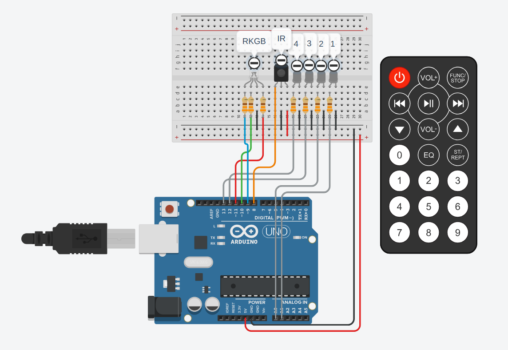
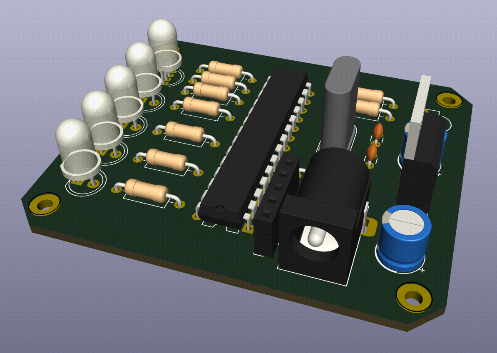
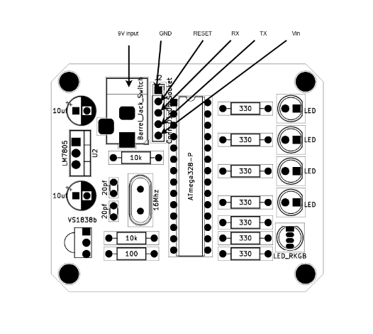

# AVR IR remote LED lamp

This project implements an infrared (IR) remote-controlled LED system using an AVR microcontroller. It allows users to adjust LED brightness and toggle RGB LED colors using a compatible IR remote control.

## Features

- Adjust RGB LED colors with volume up and down commands.
- Control LED brightness with channel up and down commands.
- Turn off all LEDs with the power command.
- Smooth LED dimming achieved through software PWM.

## Hardware Requirements

- AVR microcontroller (e.g., ATmega328P or Arduino uno)
- 1x IR receiver (VS1838B)
- 5x LEDs
  - 4x single-color
  - 1x RKGB
- 7x 330 Ohms resistors
- 1x IR remote control
- 1x Power supply (9V)

>For PCB
>- 2x 20pf ceramic capacitors
>- 2x 10uf 50V electrolytic capacitor
>- 1x 16Mhz crystal osclilator
>- 1x 100 Ohms resistors
>- 2x 10k Ohms resistors
>- 1x PCB mount DC jack
>- 1x 28 pin IC socket
>- 1x 1x5 Female header SIL
>- 1x 7805 5V voltage regulator
>- 1x ATMEGA328P IC

## Diagram
||
|:--:|
|Prototype|
||
||
|PCB|
||
||
|Pinout|
||
||
## Software Requirements

- AVR-GCC toolchain
- AVRDUDE (for flashing the microcontroller)
- Required AVR libraries (included in the [`./src/libs`](./src/libs) directory)
  - [IRremote.h](./src/libs/IRremote.h)
  - [softwarePWM.h](./src/libs/softwarePWM.h)
  - [uart.h](./src/libs/uart.h) (Optional)

## Installation

1. Connect the hardware components according to the schematic.
2. Clone this repository to your local machine.
3. Compile the source code using the AVR-GCC toolchain.
```bash
make all
```
4. Flash the compiled binary onto the AVR microcontroller using AVRDUDE.
```bash
make flash
```

## Usage

1. Power on the system.
2. Point the IR remote control towards the IR receiver module.
3. Press the appropriate buttons on the remote control to control the LEDs:
   - Volume up/down: Change RGB LED colors.
   - Channel up/down: Adjust LED brightness.
   - Power: Turn off all LEDs.
4. LED status updates will be displayed via UART communication (if needed).

## Notes
- Uncomment uart if needed.
- You may need to change command codes according to your IR remote, use uart to find your codes.
- Changing ports have to be changed in [softwarePWM.h](./src/libs/softwarePWM.h)'s channel sections.

## References
- [IRremote.h](https://www.programming-electronics-diy.xyz/2022/08/ir-remote-control-library-for-avr.html) - Liviu Istrate
- [softwarePWM.h](https://www.programming-electronics-diy.xyz/2021/02/multi-channel-software-pwm-library-for.html) - Liviu Istrate

## Contributions

Contributions are welcome! Feel free to submit bug reports, feature requests, or pull requests.
